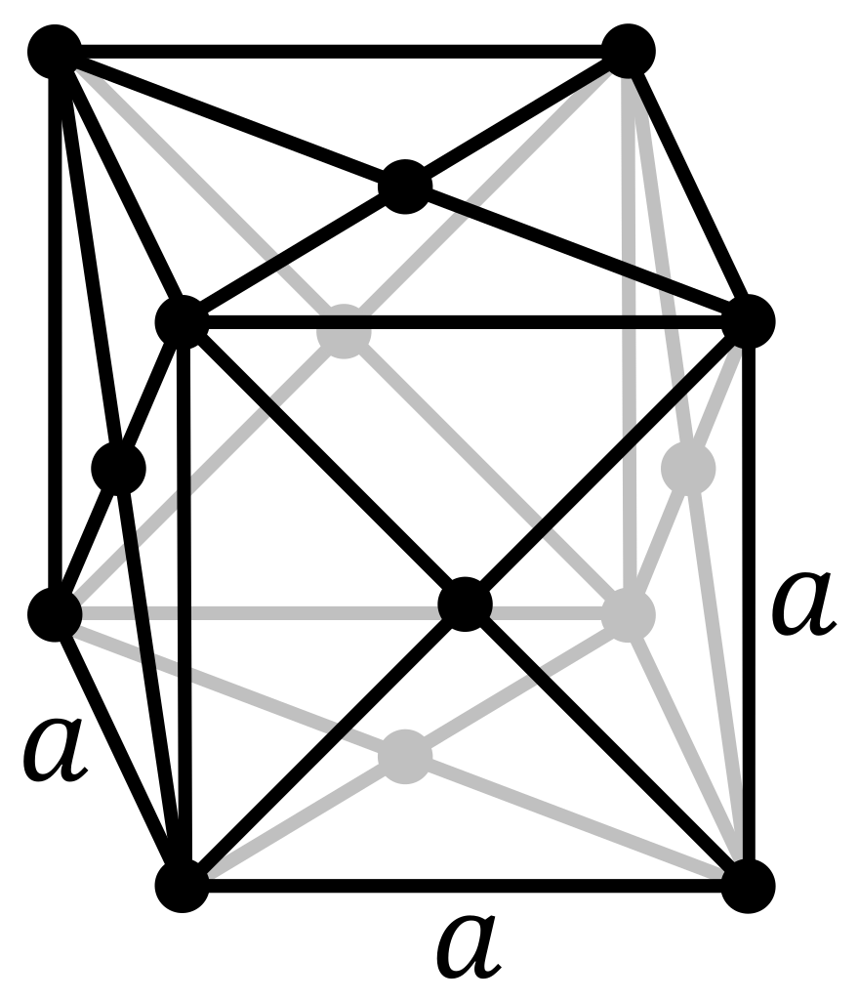

# Crystal Structure and Crystal Packing
## Crystal Structures

Crystals in a material are built up with crystal lattice. Crystal structures can be defined as a unit cell, which is the smallest group of atoms that has the same crystal structure.

### FCC - Face-centred cubic lattice

The FCC lattice is a cubic unit cell with one atom on each corner and one atom on each face.
There are $(8\times\frac{1}{8}) + (6\times\frac{1}{2}) = 4$ atoms in each unit cell.

